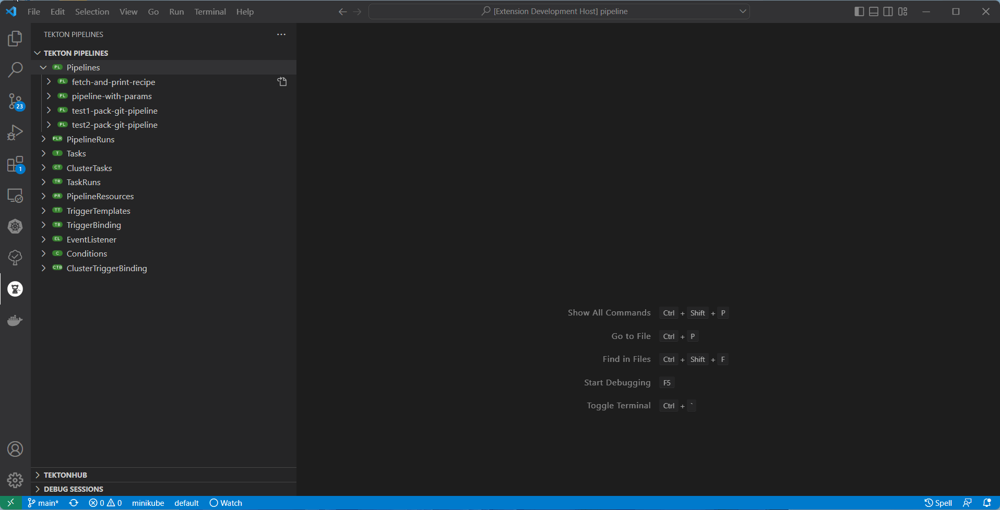
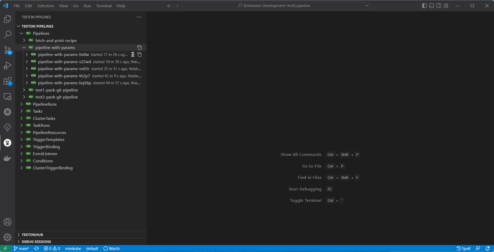
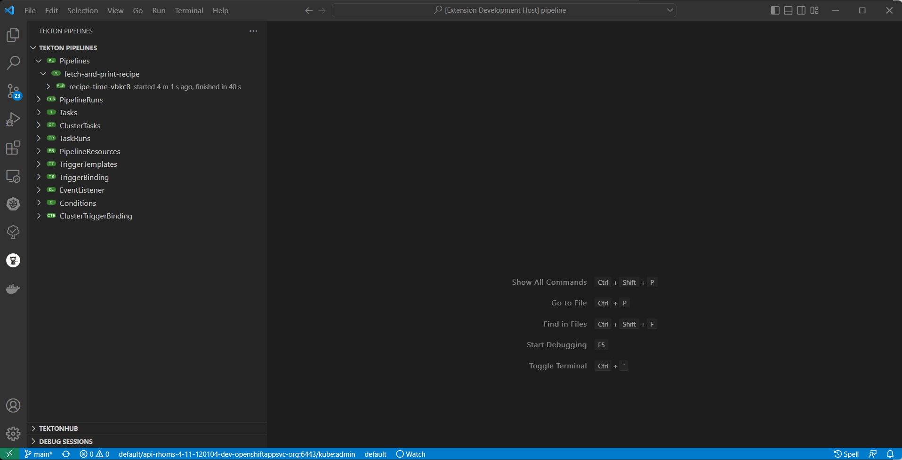
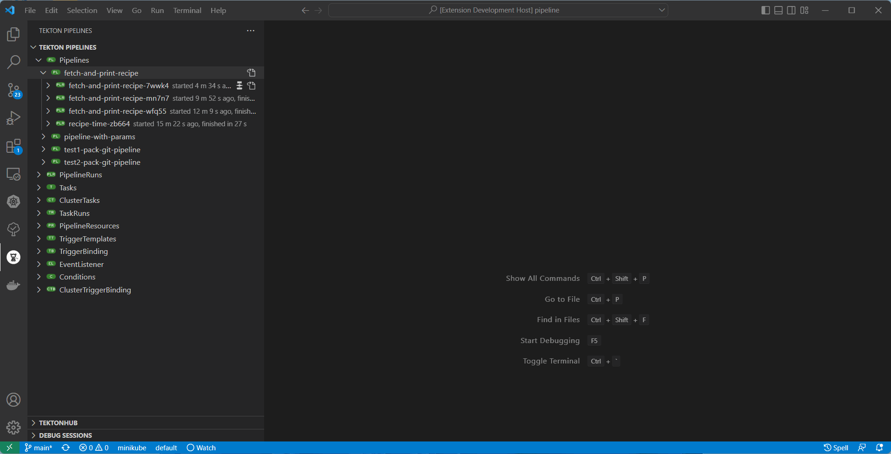

### Tekton Pipelines Tutorial

To get started with Tekton and learn how to create and run a simple pipeline for building and deploying containerized app on Kubernetes/OpenShift, you can follow one of these tutorials:

* [Tekton Pipelines Tutorial](https://github.com/tektoncd/pipeline/blob/master/docs/tutorial.md)
* [OpenShift Pipelines Tutorial](https://github.com/openshift/pipelines-tutorial)

### TektonHub

   * TektonHub Integration:

      

   * Install Task from TektonHub as ClusterTask:

      

### Wizard for Pipeline Start

   * Start Pipeline:

      

   * Pipeline with Workspace:

      

   * Create new PVC:

      

### Show Tekton TaskRun/PipelineRun Logs in Editor

### Tekton variables code completion

### Add Trigger support

### Restart Pipeline with previous PipelineRun content

### Deploy resource on save
>Note: This is experimental feature, you need to enable it in VSCode Setting Preferences

### 'Go to Definition' for Tekton Pipeline yaml

### Tekton tree auto refresh and open resource from an inline command

### PipelineRun Preview

### Setup OpenShift/Kubernetes Cluster to use with the Extension

To use the extension, developers can deploy Tekton Pipelines into [Red Hat OpenShift Local](https://developers.redhat.com/products/openshift-local/overview) or a `minikube` instance.

#### Red Hat OpenShift Local

- Red Hat OpenShift Local is the quickest way to get started building OpenShift clusters. It is designed to run on a local computer to simplify setup and testing, and to emulate the cloud development environment locally with all of the tools needed to develop container-based applications. Follow [this documentation](https://access.redhat.com/documentation/en-us/red_hat_openshift_local) to get it up and running. After cluster is started follow [these steps](https://github.com/openshift/pipelines-tutorial/#install-openshift-pipelines) to deploy OpenShift Pipelines into an OpenShift cluster.

#### minikube

- For detailed analysis of how to setup Tekton Pipelines into minikube instance, please follow the [instructions/tutorial](https://github.com/tektoncd/pipeline#want-to-start-using-pipelines).
