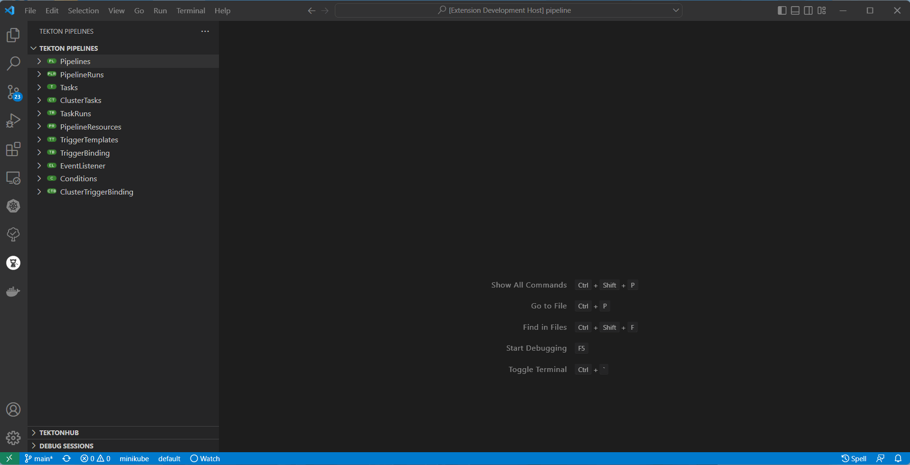

# Tekton Pipelines

Tekton Pipelines extension provides an end-to-end developer experience for interaction with [Tekton](https://tekton.dev/).

Using this extension:

   * Developer can create Tekton resource easily by using [Deploy resource on save](#deploy-resource-on-save).
   * Install Task/ClusterTask from TektonHub [TektonHub integration](#TektonHub).
   * Support for start Pipeline, Workspace and create new PVC(PersistentVolumeClaim) [Wizard for Pipeline Start](#Wizard-for-Pipeline-Start).
   * Show Tekton TaskRun/PipelineRun Logs in Editor [Show logs](#show-tekton-taskrunpipelinerun-logs-in-editor).
   * Support for [Adding Trigger](#add-trigger-support).
   * Tekton variables [code completion](#tekton-variables-code-completion).
   * Pipeline/PipelineRun [preview diagram](#pipelinerun-preview)

 

# Getting Started

### Features

For more detail information around specific commands & features, please read the [plugin features](README.features.md) detailed guide.

### Tutorial

Follow Tekton Pipeline Extension [tutorial](TUTORIAL.md) inspired by [original tutorial](https://github.com/openshift/pipelines-tutorial) that uses `OpenShift Developer Console`, `tkn` and `oc` command line tools.

### Commands

Tekton Pipelines extension supports a number of commands & actions for interacting with Tekton Pipelines; these are accessible via the command menu (`Cmd+Shift+P` <kbd>⌘⇧P</kbd> on macOS or `Ctrl+Shift+P` <kbd>⌃⇧P</kbd> on Windows and Linux) and may be bound to keys in the normal way.

* `Tekton: About` - Provides the `tkn` tool version.
* `Tekton: Show Output Channel` - Shows commands running under the hood and their output.
* `Tekton: Refresh View` - Refreshes the Tekton Pipeline View.

#### Actions available for a Tekton Pipeline/Task/ClusterTask

   * `Pipeline -> Start` - Start a Pipeline with user indicated resources, parameters and service account.
   * `Pipeline -> Restart` - Restart the last Pipeline run.
   * `Pipeline/Task/ClusterTask -> List` - List all Pipelines in a Cluster.
   * `Pipeline -> Describe` - Prints the JSON of a selected Pipeline.
   * `Pipeline/Task/ClusterTask -> Delete` - Delete the selected Pipeline.

#### Actions available for a Tekton PipelineRun

   * `PipelineRun/TaskRun -> List` - List all PipelineRuns/TaskRuns in a Pipeline/Task
   * `PipelineRun/TaskRun -> Describe` - Describe the selected PipelineRun/TaskRun
   * `PipelineRun/TaskRun -> Logs` - Print Logs from the selected PipelineRun/TaskRun
   * `PipelineRun/TaskRun -> Delete` - Delete the selected PipelineRun/TaskRun
   * `PipelineRun -> Cancel` - Cancel the selected PipelineRun

### Icons Representation

Pipeline Node

Task Node

ClusterTask Node

PipelineResource Node

PipelineRun/TaskRun Running

PipelineRun Failed

TaskRun Failed

Condition Failed

PipelineRun Pending

TaskRun Pending

Condition Pending
 

### Extension Configuration Settings
   * `Tekton Pipelines: Show Channel On Output` - Show Tekton Pipelines output channel when new text added to output stream.
   * `Tekton Pipelines: Output verbosity level` - Output verbosity level (value between 0 and 9) for Tekton Pipeline Start, Push and Watch commands in output channel and integrated terminal.
   * `Tekton Pipelines: Show reference resource notification` - Enable/disable to check Task and ClusterTask Reference Resource.
   * `Tekton Pipelines: Show logs on pipeline start` - Show pipelineRun follow logs while starting pipeline.

## Dependencies

#### CLI Tools

- This extension uses the [Tekton CLI](https://github.com/tektoncd/cli):  `tkn`.
- This extension is designed to work with Tekton Pipelines 0.11+.

Note: We support `v1beta1` API. Previous version `v1alpha1` may work, but we cannot guarantee that all features will work properly. If you have `v1alpha1` pipelines/tasks please use [migrating document](https://github.com/tektoncd/pipeline/blob/main/docs/migrating-v1alpha1-to-v1beta1.md) to migrate to `v1beta1`.

## Release notes

See the [change log](CHANGELOG.md).

## Contributing

This is an open source project open to anyone. This project welcomes contributions and suggestions!

For information on getting started, refer to the [CONTRIBUTING instructions](CONTRIBUTING.md).

Download the most recent `tekton-pipelines-<version>.vsix` file and install it by following the instructions [here](https://code.visualstudio.com/docs/editor/extension-gallery#_install-from-a-vsix).

## Feedback

If you discover an issue please file a bug and we will fix it as soon as possible.
* File a bug in [GitHub Issues](https://github.com/redhat-developer/vscode-tekton/issues).
* Open a [Discussion on GitHub](https://github.com/redhat-developer/vscode-tekton/discussions).

If you want to chat with us, you can contact us on the `#ide-integration` channel of the `tektoncd` Slack. Please click this [link](https://join.slack.com/t/tektoncd/shared_invite/enQtNjQ1NjQzNTQ3MDQwLTc5MWU4ODg3MGJiYjllZjlmMWI0YWFlMzJjMTkyZGEyMTFhYzY1ZTkzZGU0M2I3NGEyYjU2YzNhOTE4OWQyZTM) to join the `tektoncd` Slack.

## License

MIT, See [LICENSE](LICENSE) for more information.

## Data and telemetry

The Red Hat OpenShift Toolkit for Visual Studio Code collects anonymous [usage data](USAGE_DATA.md) and sends it to Red Hat servers to help improve our products and services. Read our [privacy statement](https://developers.redhat.com/article/tool-data-collection) to learn more. This extension respects the `redhat.telemetry.enabled` setting which you can learn more about at https://github.com/redhat-developer/vscode-redhat-telemetry#how-to-disable-telemetry-reporting
