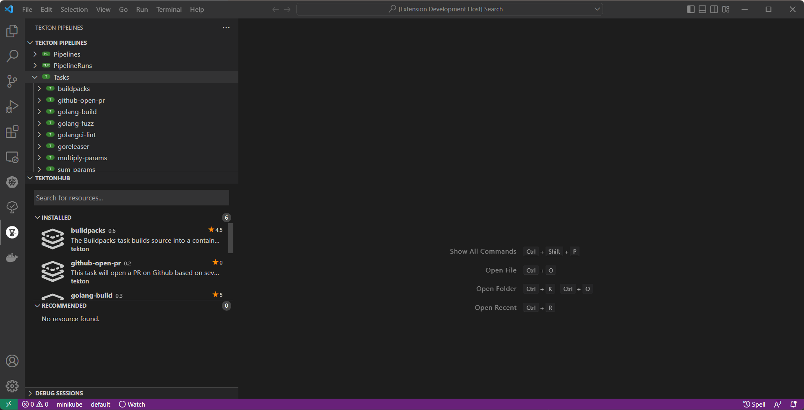
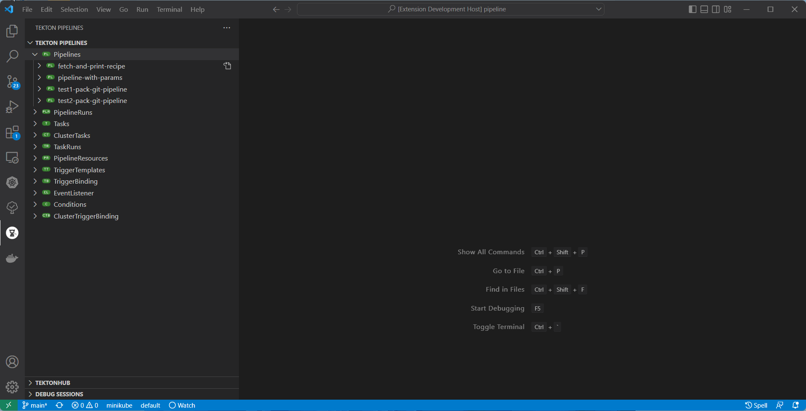
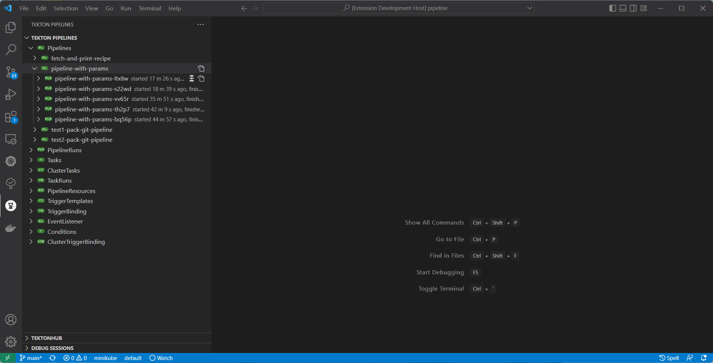
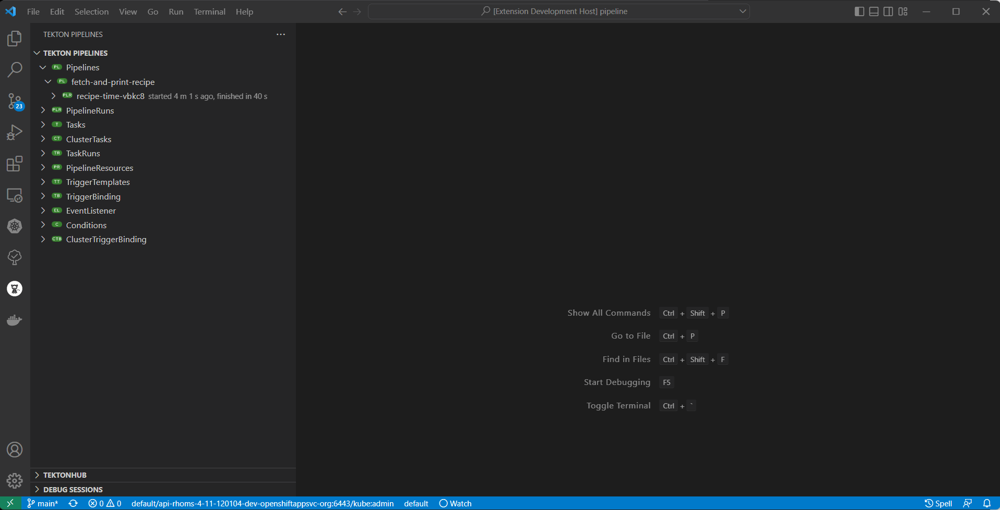
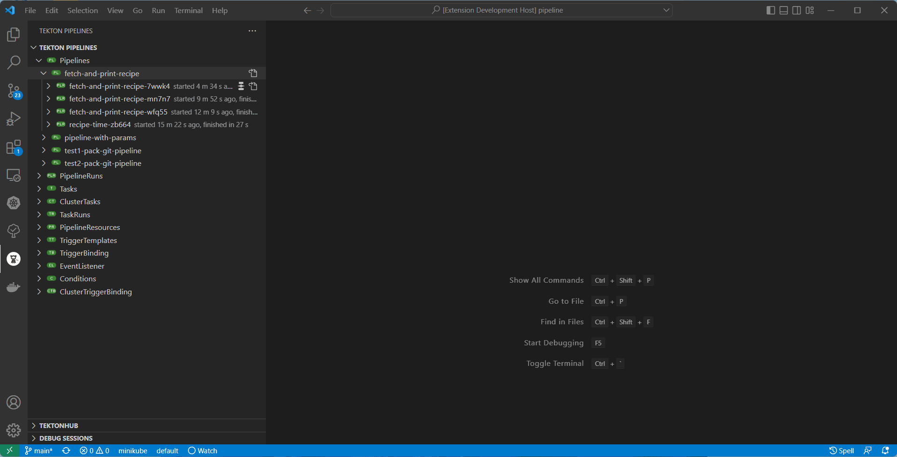
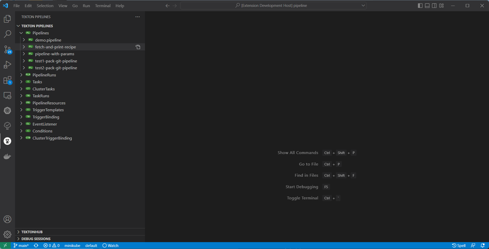
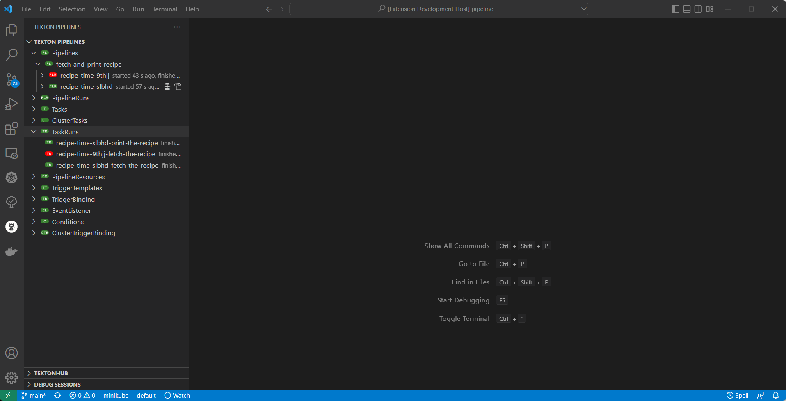
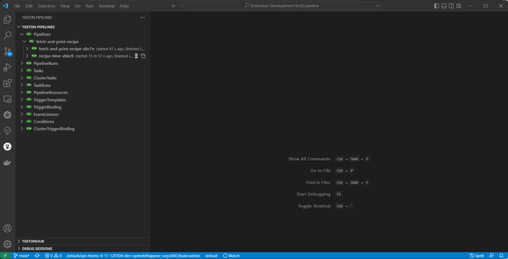

# Tekton Pipelines Extension  

## Overview

Tekton Pipelines extension provides an end-to-end developer experience for interaction with [Tekton](https://tekton.dev/).

Using this extension:

   * Developer can create Tekton resource easily by using [Deploy resource on save](#deploy-resource-on-save).
   * Install Task/ClusterTask from TektonHub [TektonHub integration](#TektonHub).
   * Support for start Pipeline, Workspace and create new PVC(PersistentVolumeClaim) [Wizard for Pipeline Start](#Wizard-for-Pipeline-Start).
   * Show Tekton TaskRun/PipelineRun Logs in Editor [Show logs](#show-tekton-taskrunpipelinerun-logs-in-editor).
   * Support for [Adding Trigger](#add-trigger-support).
   * Tekton variables [code completion](#tekton-variables-code-completion).
   * Pipeline/PipelineRun [preview diagram](#pipelinerun-preview)

### Tekton version

This extension is designed to work with Tekton Pipelines 0.11+.

### Tekton API version

We support `v1beta1` API. Previous version `v1alpha1` may work, but we cannot guarantee that all features will work properly. If you have `v1alpha1` pipelines/tasks please use [migrating document](https://github.com/tektoncd/pipeline/blob/main/docs/migrating-v1alpha1-to-v1beta1.md) to migrate to `v1beta1`.

A Visual Studio Code extension for interacting with Tekton Pipelines.

## New and Noteworthy

### TektonHub

   * TektonHub Integration:

      

   * Install Task from TektonHub as ClusterTask:

      

### Wizard for Pipeline Start

   * Start Pipeline:

      

   * Pipeline with Workspace:

      

   * Create new PVC:

      

### Show Tekton TaskRun/PipelineRun Logs in Editor

### Tekton variables code completion

### Add Trigger support

### Restart Pipeline with previous PipelineRun content

### Deploy resource on save
>Note: This is experimental feature, you need to enable it in VSCode Setting Preferences

### 'Go to Definition' for Tekton Pipeline yaml

### Tekton tree auto refresh and open resource from an inline command

### PipelineRun Preview

### Setup Kubernetes Cluster to use with the Extension

To use the extension, developers can deploy Tekton Pipelines into a `minikube` instance or use [Red Hat OpenShift Local](https://developers.redhat.com/products/openshift-local/overview).

#### Red Hat OpenShift Local

Red Hat OpenShift Local is the quickest way to get started building OpenShift clusters. It is designed to run on a local computer to simplify setup and testing, and to emulate the cloud development environment locally with all of the tools needed to develop container-based applications. Follow [this documentation](https://access.redhat.com/documentation/en-us/red_hat_openshift_local/2.10/html/getting_started_guide/index) to get it up and running. After cluster is started follow [these steps](https://github.com/openshift/pipelines-tutorial/#install-openshift-pipelines) to deploy OpenShift Pipelines into an OpenShift cluster.

#### minikube

For detailed analysis of how to setup Tekton Pipelines into minikube instance, please follow the [instructions/tutorial](https://github.com/tektoncd/pipeline#want-to-start-using-pipelines).

### Tutorial

Follow Tekton Pipeline Extension [tutorial](TUTORIAL.md) inspired by [original tutorial](https://github.com/openshift/pipelines-tutorial) that uses OpenShift Developer Console, `tkn` and `oc` command line tools.

### Commands and features

Development of the Tekton Pipelines Extension is largely following development of the [`tkn` CLI](https://github.com/tektoncd/cli) as well as [Tekton Pipelines](https://github.com/tektoncd/pipeline) which are both under active development and potentially subject to drastic changes. Please don't hesitate to open an [issue](issues) if you find a bug or something breaks unexpectedly. Pull Requests are always welcome--see the [CONTRIBUTING](CONTRIBUTING.md) section for details.

`tekton-pipelines` supports a number of commands & actions for interacting with Tekton Pipelines; these are accessible via the command menu (`Cmd+Shift+P` <kbd>⌘⇧P</kbd> on macOS or `Ctrl+Shift+P` <kbd>⌃⇧P</kbd> on Windows and Linux) and may be bound to keys in the normal way.

* `Tekton: About` - Provides the `tkn` tool version.
* `Tekton: Show Output Channel` - Shows commands running under the hood and their output.
* `Tekton: Refresh View` - Refreshes the Tekton Pipeline View.

#### Actions available for a Tekton Pipeline/Task/ClusterTask

   * `Pipeline -> Start` - Start a Pipeline with user indicated resources, parameters and service account.
   * `Pipeline -> Restart` - Restart the last Pipeline run.
   * `Pipeline/Task/ClusterTask -> List` - List all Pipelines in a Cluster.
   * `Pipeline -> Describe` - Prints the JSON of a selected Pipeline.
   * `Pipeline/Task/ClusterTask -> Delete` - Delete the selected Pipeline.

#### Actions available for a Tekton PipelineRun

   * `PipelineRun/TaskRun -> List` - List all PipelineRuns/TaskRuns in a Pipeline/Task
   * `PipelineRun/TaskRun -> Describe` - Describe the selected PipelineRun/TaskRun
   * `PipelineRun/TaskRun -> Logs` - Print Logs from the selected PipelineRun/TaskRun
   * `PipelineRun/TaskRun -> Delete` - Delete the selected PipelineRun/TaskRun
   * `PipelineRun -> Cancel` - Cancel the selected PipelineRun

#### Icons Representation

Pipeline Node

Task Node

ClusterTask Node

PipelineResource Node

PipelineRun/TaskRun Running

PipelineRun Failed

TaskRun Failed

Condition Failed

PipelineRun Pending

TaskRun Pending

Condition Pending

### Extension Configuration Settings
   * `Tekton Pipelines: Show Channel On Output` - Show Tekton Pipelines output channel when new text added to output stream.
   * `Tekton Pipelines: Output verbosity level` - Output verbosity level (value between 0 and 9) for Tekton Pipeline Start, Push and Watch commands in output channel and integrated terminal.
   * `Tekton Pipelines: Show reference resource notification` - Enable/disable to check Task and ClusterTask Reference Resource.
   * `Tekton Pipelines: Show logs on pipeline start` - Show pipelineRun follow logs while starting pipeline.

### Dependencies

#### CLI Tools

This extension uses the [Tekton CLI](https://github.com/tektoncd/cli):  `tkn`

#### Extensions

This extension depends on Kubernetes Extension from Microsoft which is going to be installed automatically along with the Tekton Pipelines Extension. The image below demonstrates the Kubernetes Extension public API displaying Tekton specific resources: ClusterTasks, Tasks, Pipelines, Pipeline Resources, PipelineRun, TaskRun in the Kubernetes Clusters View.

## Release notes

See the [change log](CHANGELOG.md).

Nightly builds
==============

## WARNING: Nightly builds are by definition unstable. Install at your own risk.

Nightly builds are published every 24 hours and available from this [location](https://download.jboss.org/jbosstools/adapters/snapshots/vscode-tekton/?C=M;O=D) with most recent build is on top of the list.
To install nightly build, download latest extension `.vsix` package and follow the steps on image below.

Contributing
============
This is an open source project open to anyone. This project welcomes contributions and suggestions!

For information on getting started, refer to the [CONTRIBUTING instructions](CONTRIBUTING.md).

Download the most recent `tekton-pipelines-<version>.vsix` file and install it by following the instructions [here](https://code.visualstudio.com/docs/editor/extension-gallery#_install-from-a-vsix).

Feedback & Questions
====================
If you discover an issue please file a bug and we will fix it as soon as possible.
* File a bug in [GitHub Issues](https://github.com/redhat-developer/vscode-tekton/issues).
* Or contact us in [Tekton Slack](https://github.com/tektoncd/community/blob/main/contact.md#slack) `#ide-integration` channel

License
=======
MIT, See [LICENSE](LICENSE) for more information.

## Data and telemetry

The Red Hat Tekton Pipelines Extension for Visual Studio Code collects anonymous [usage data](USAGE_DATA.md) and sends it to Red Hat servers to help improve our products and services. Read our [privacy statement](https://developers.redhat.com/article/tool-data-collection) to learn more. This extension respects the `redhat.telemetry.enabled` setting which you can learn more about at https://github.com/redhat-developer/vscode-redhat-telemetry#how-to-disable-telemetry-reporting
